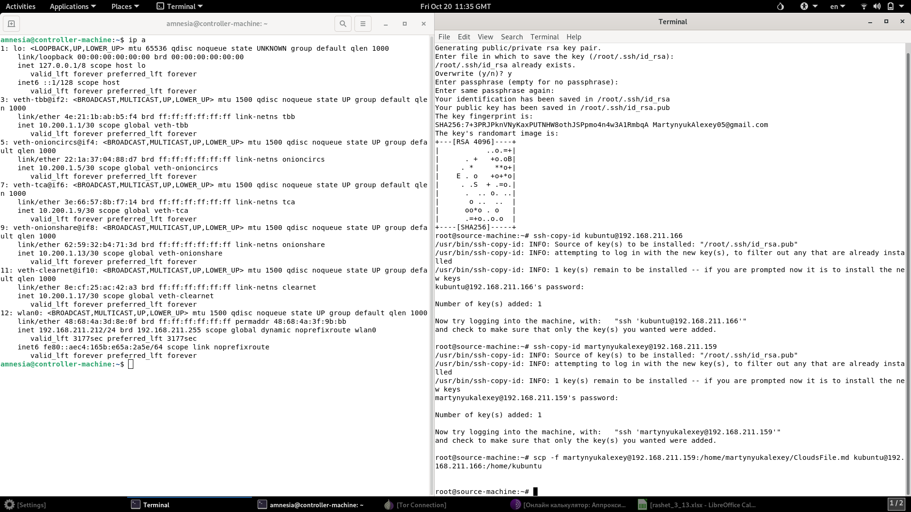
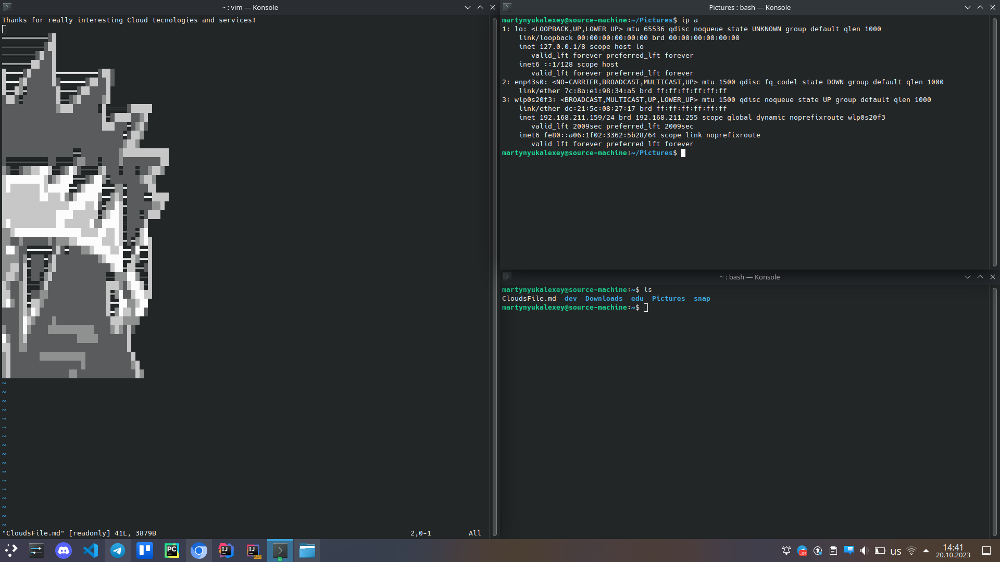
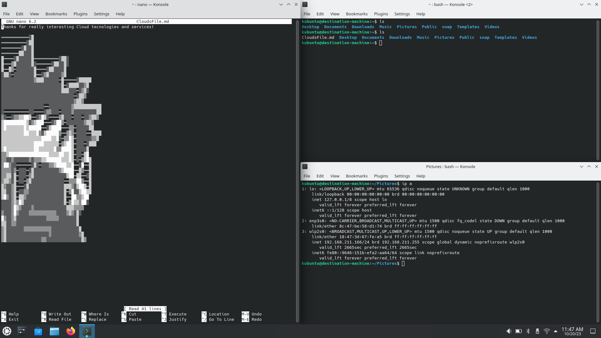

# Лабораторная работа 1

## Задание

Три компьютера (A, B, C) находятся в одной локальной сети. Пользуясь терминалом в компьютере A, перенести файл с B на C. 

Усложнение: повторить работу с использованием ассиметричного шифрования (публичный и приватные ключи) вместо стандартных 
логина и пароля.

**Для выполнения работы допустимы только MacOS/Linux**

## Решение

Для выполнения работы использовались ноутбуки с:

1. Linux tails 5.19 в лайв режиме (A, controller)
1. Установленной Kubuntu 22.04 (B, source)
1. Kubuntu 22.04 в лайв режиме (C, destination)

Для объединения в сеть все машины были подключены к одному wi-fi.

Предварительно на все ноутбуки были установлены OpenSSH-server и OpenSSH-client.

С помощью `ip a` были определены ip адреса ноутбуков в локальной сети (см. скриншоты ниже):

1. 192.168.211.212 (A)
1. 192.168.211.159 (B)
1. 192.168.211.166 (C)

Команда `ssh-keygen` генерирует и сохраняет в файл пару ключей. `-t` позволяет указать алгоритм, `-b` - размер ключа.
Итоговый вариант: `ssh-keygen -r rsa -t 4096`.

Команда `ssh-copy-id`  позволяет передать публичный ключ на удаленный хост. Это, в свою очередь, позволяет избежать 
использование логина и пароля во время ssh соединений.

Наконец, следующая команда позволяет перенести файл (директорию) с одной машины на другую.

```shell
scp <hostname FROM>@<ip address FROM>:<path FROM> <hostnam TO>@<ip address TO>:<path TO>
```

В нашем случае:

```shell
scp martynyukalexey@192.168.211.159:/home/martynyukalexey/CloudFile.md kubuntu@92.168.211.166:/home/kubuntu
```

Ниже прикреплены соответствующие скриншоты.

Ноутбук A (controller):


Ноутбук B (source):


Ноутбук C (destination):


### Вопросы к лабораторной работе

SSH (Secure Shell) — сетевой протокол прикладного уровня, позволяющий производить удалённое
управление операционной системой и туннелирование TCP-соединений (например, для передачи файлов).
Схож по функциональности с протоколами Telnet и rlogin, но, в отличие от них, шифрует весь трафик, включая
передаваемые пароли. SSH допускает выбор различных алгоритмов шифрования.
SSH позволяет безопасно передавать в незащищённой среде практически любой другой сетевой протокол.

SSH-туннель — это туннель, создаваемый посредством SSH-соединения и используемый для шифрования
туннелированных данных. Используется для того, чтобы обезопасить передачу данных в Интернете
(аналогичное назначение имеет IPsec). При пересылке через SSH-туннель незашифрованный трафик любого
протокола шифруется на одном конце SSH-соединения и расшифровывается на другом.

SCP (Secure Copy) - средство безопасной передачи компьютерных файлов между локальным хостом и удаленным хостом
или между двумя удаленными хостами. Основан на протоколе SSH. «SCP» часто относится как к протоколу безопасного
копирования, так и к реализующей его программе.

Асимметричное шифрование с открытым ключом базируется на следующих принципах:
1. Можно сгенерировать пару очень больших чисел (открытый ключ и закрытый ключ) так, чтобы, зная открытый ключ, 
нельзя было вычислить закрытый ключ за разумный срок. При этом механизм генерации является общеизвестным.
1. Имеются надёжные методы шифрования, позволяющие зашифровать сообщение открытым ключом так, чтобы расшифровать 
его можно было только закрытым ключом. Механизм шифрования является общеизвестным.
1. Владелец двух ключей никому не сообщает закрытый ключ, но передает открытый ключ контрагентам или делает его 
общеизвестным.
1. Если необходимо передать зашифрованное сообщение владельцу ключей, то отправитель должен получить открытый ключ. 
Отправитель шифрует свое сообщение открытым ключом получателя и передает его получателю (владельцу ключей) по открытым 
каналам. При этом расшифровать сообщение не может никто, кроме владельца закрытого ключа.


